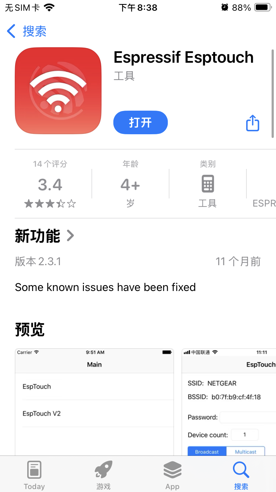
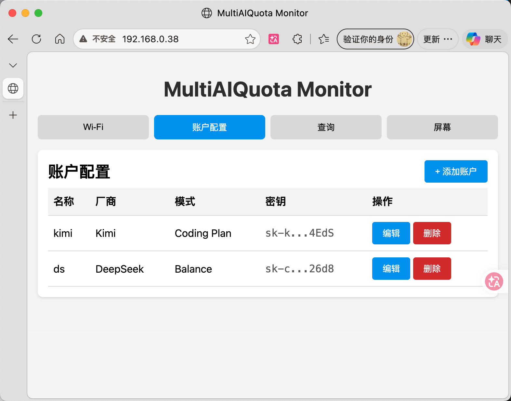
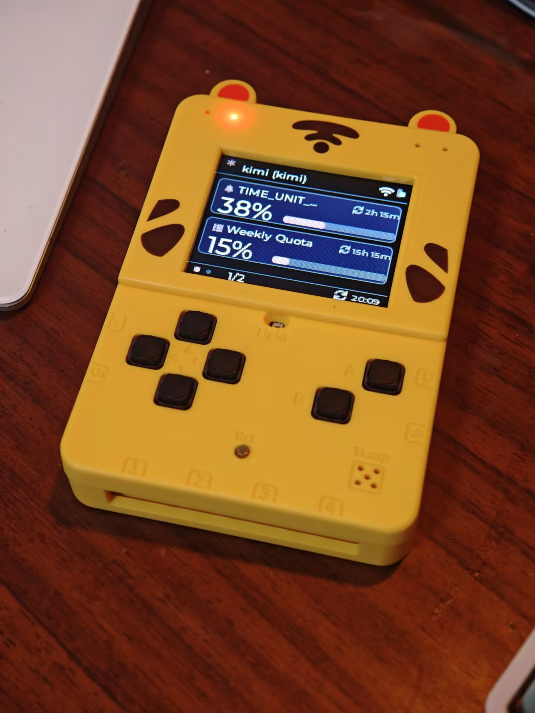

# MultiAIQuota

多厂商 AI **Coding Plan / Token Plan / 余额** 查询工具（C++20）。

- `core`：跨平台核心库（类型、配置、HTTP、Provider 解析）。
- `cli`：命令行工具 `maiq`。
- `host_sim`：PC 端 LVGL + SDL2 主机模拟器。
- `hw_monitor`：ESP32-IDF 5.5 固件（项目名 `MultiAIQuotaMonitor`）。

MVP 阶段实现 **Kimi**、**DeepSeek** 与 **Codex**；其他厂商在 `Vendor`/`Provider` 中保留接口，暂未实现。

## 快速开始

```bash
# 1. 创建本地配置（不要把真实 key 提交到仓库）
./build/cli/maiq init > maiq.json
# 编辑 maiq.json，填入你的 api_key

# 2. 查询（默认读取当前目录的 maiq.json）
./build/cli/maiq query
./build/cli/maiq query --format json
./build/cli/maiq query --vendor kimi --account my-kimi-code

# 3. 列出账户（密钥会脱敏）
./build/cli/maiq list

# 4. 显式指定配置路径
./build/cli/maiq -c /path/to/config.json query
```

`maiq.json` 已加入 `.gitignore`。配置搜索顺序：

1. `-c, --config` 显式路径
2. 环境变量 `MAIQ_CONFIG`
3. 当前目录的 `maiq.json`
4. `$HOME/.config/multi-ai-quota/config.json`

## 目录结构

```
MultiAIQuota/
├── core/               # 核心库（纯 C++20）
├── cli/                # 命令行工具
├── gui/                # LVGL 共享页面
├── host_sim/           # PC 端 LVGL/SDL2 模拟器
├── hw_monitor/         # ESP32-IDF 工程
├── pc/                 # PC 端 HttpClient 实现（cpp-httplib）
├── tests/              # 单元测试
└── third_party/        # ArduinoJson、lvgl（ESP32 组件）
```

## 支持的厂商（MVP）

| 厂商 | 模式 | 认证 |
|---|---|---|
| Kimi / Moonshot | `coding_plan`、`balance` | Bearer API Key |
| DeepSeek | `balance` | Bearer API Key |
| Codex (OpenAI ChatGPT 登录) | `coding_plan` | `codex_oauth` access_token + account_id |

## 配置示例

```json
{
  "accounts": [
    {
      "name": "my-kimi-code",
      "vendor": "kimi",
      "mode": "coding_plan",
      "auth_type": "bearer",
      "api_key": "sk-kimi-xxx"
    },
    {
      "name": "my-deepseek",
      "vendor": "deepseek",
      "mode": "balance",
      "auth_type": "bearer",
      "api_key": "sk-xxx"
    },
    {
      "name": "my-codex",
      "vendor": "codex",
      "mode": "coding_plan",
      "auth_type": "codex_oauth",
      "access_token": "从 ~/.codex/auth.json 的 tokens.access_token 复制",
      "account_id": "从 ~/.codex/auth.json 的 tokens.account_id 复制"
    }
  ]
}
```

## 硬件与 Web 配置

`hw_monitor` 默认面向参考项目中的 **Xueersi ESP32** 板（学而思ESP32）：

- 主控：ESP32-WROVER-B，4 MB flash，无 PSRAM
- 屏幕：ST7735 160×128 SPI TFT
- 按键：KEY1（GPIO34）切换账户，KEY2（GPIO12）立即刷新，均低电平有效
- 蜂鸣器：GPIO14（暂未使用）
- 网络：STA + SmartConfig（ESPTouch）配网，Wi-Fi 凭据存 NVS
- Web：内置 Svelte 前端 + RESTful API，首次配网后访问设备 IP 即可配置账户和查询

构建目标使用 `esp32`，详情见 `BUILD.md`。

### 烧录

从actions处下载固件，使用https://espressif.github.io/esptool-js/ ，Program波特率选择115200，然后connect，选择gd32 cdc那个

文件方面，添加以下文件及地址

* 0x1000 bootloader.bin
* 0x10000 MultiAIQuotaMonitor.bin
* 0x8000 partition-table.bin
* 0x310000 littlefs.bin

然后点击program即可。

### 配网

使用esptouch



### 配置

在你的路由器后台找到ip，或者从log中找到ip，然后访问它，选择账户配置，添加账户即可

需要注意如果你的环境需要代理访问gpt，codex在这其实不怎么可用





## 安全提示

- 真实 API Key 只应放在本地 `maiq.json` 中。
- CLI `list` 会对密钥做脱敏处理。
- ESP32 上配置以 JSON blob 形式存放在 NVS 中，Web 前端静态文件存放在 LittleFS；后续可启用 Flash 加密。

## 许可证

MIT
